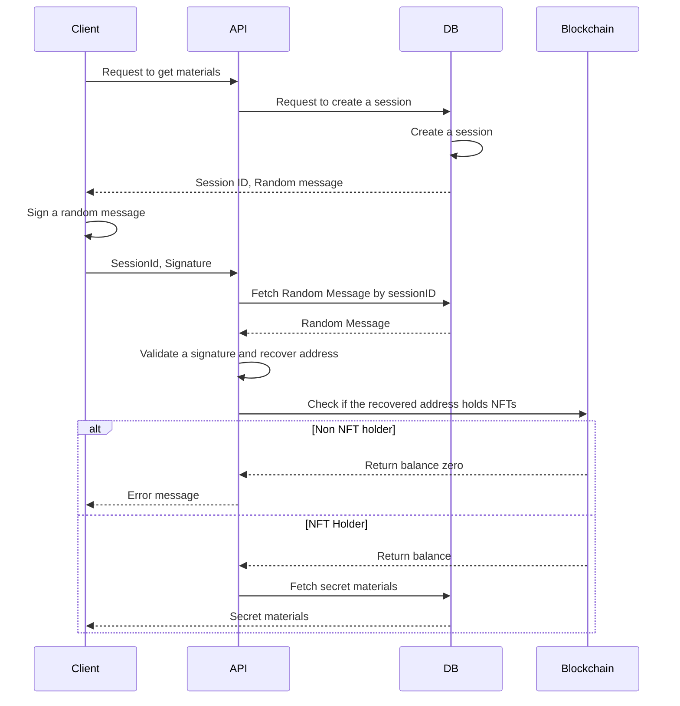

# Sequence diagrams

## Google Cloud Console
- Activate IAM API
  - https://console.cloud.google.com/flows/enableapi?apiid=iam.googleapis.com&redirect=https://console.cloud.google.com
- Create service account and generate key
  - grant access of firebase
  - https://cloud.google.com/iam/docs/creating-managing-service-account-keys

# References
- rainbowkit nextjs-13 upgrade
  - https://normad.hashnode.dev/rainbowkit-nextjs-13-upgrade
- Hardhat Boilerplate Project
  - https://hardhat.org/tutorial/boilerplate-project
- React Truffle Box¶
  - https://trufflesuite.com/boxes/react/
- I should understand more about Next 13
  - The "use client" directive
    - https://nextjs.org/docs/getting-started/react-essentials#the-use-client-directive
- wagmi
  - https://wagmi.sh/core/getting-started
- viem
  - https://viem.sh/docs/getting-started.html
- routing
  - https://nextjs.org/docs/app/building-your-application/routing
- Route Handlers
  - https://nextjs.org/docs/app/building-your-application/routing/router-handlers
